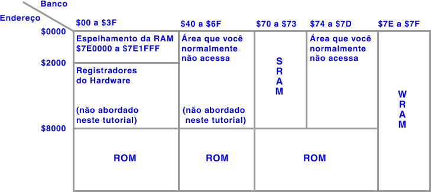

# The SNES memory

Writing assembly involves writing a bunch of instructions where you load a "value" and store it at an "address" in order to get a desired effect, such as changing the player's powerup. When writing assembly, you will work with the SNES memory most of the time.

The SNES memory basically is a region of bytes, and each byte is located at an "address". Think of it like a chessboard:

You can see that in order to refer to a certain cell, the image makes use of column and cell names. The "address" of the shown queen \(the "value"\) would be address D8, for example. Also, a single cell can't hold two units. This same concept applies to the SNES memory.

The SNES memory is mapped from address $000000 to $FFFFFF, although only $000000-$7FFFFF is used in most cases. The format of an address is as follows: $BBHHDD.

* BB is the "bank byte" of the address
* HH is the "high byte" of the address
* DD is the "low byte" of the address

Addresses can be written in 3 ways: $BBHHDD, $HHDD and $DD, such as $7E0003, $0003 and $03.

* Addresses in the $DD-notation are called "direct page"
* Addresses in the $HHDD-notation are called "absolute addresses"
* Addresses in the $BBHHDD-notation are called "long addresses"

As established earlier, an address may contain only one byte. If you access a certain address in 16-bit mode, it means you actually access both "address" and "address+1", because a 16-bit number consists of two bytes.

Here’s a drawing to get a general overview of the basic SNES memory \(also known as a memory map\):

This memory map is in the "LoROM" format. If you're a SMW hacker, you don't have to worry about what this means; just take this memory map for granted.

## ROM

ROM stands for "Read-Only Memory" and it's exactly that: memory that can be only read. This means that you cannot change the ROM by storing values to it with ASM. You can say it is the game or program itself, which contains all the ASM code and data tables, as well as assets like graphics, music, and so on. Alternatively: It’s the .smc/.sfc/.fig/etc. file which you load in emulators.

## RAM

RAM stands for "Random-Access Memory". This is the dynamic memory which allows anything to be written to it at any time. You could say that this is the place where you have variables which are important and have meaning. RAM can be written to in order to achieve a certain effect. For example, if you write $04 to the player’s extra lives, then the player will have exactly 4 extra lives.

The SNES RAM is 128kB big, and it is located at addresses $7E0000-$7FFFFF. The SNES RAM is completely generic. There is no such rule as "address $7E0120 is used for lives in every SNES game ever". You define the purpose of RAM yourself, by writing ASM code.

The memory map shows that banks $00-3F contain a RAM "mirror". Mirrored RAM addresses are addresses which contain the same value across every bank. This means that RAM address $001234 contains the exact same value as $0F1234 at all times. Having the RAM mirrored means that code executing in the ROM at those banks can access RAM $7E0000-$7E1FFF more "easily". Conversely, code executing at banks $40-6F have more trouble accessing the RAM because the RAM isn't mirrored there.

For the sake of simplicity, you can **always** assume that bank $00 equals bank $7E.

## SRAM

SRAM stands for "Static Random-Access Memory". It is also 128kB big, and it is located in blocks of 32kB at $700000-$707FFF, $710000-$717FFF, $720000-$727FFF and $730000-$737FFF, although the final size of SRAM depends on the ROM specifications itself, thanks to something called the "internal ROM header. The SRAM isn’t mirrored in other banks.

SRAM behaves exactly like RAM; you can store anything and load anything from it, but the values do not get cleared when the SNES resets. The SRAM is kept alive with an actual button-cell battery on a real SNES cartridge. When the battery dies, or is removed, SRAM won't function properly and will possibly lose data after every reset. On emulators, SRAM is stored in the well-known ".srm"-files.

SRAM is usually used for save files, although it can also be used as extra RAM.

