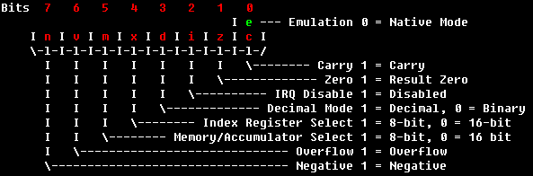
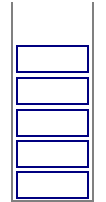

# Introduction

Assembly for the SNES

An ASM tutorial

**Author**: Ersanio  
**Date of publishing**: 3rd of February, 2016

**Latest update:** 19th of August, 2016

**Website**: http://www.smwcentral.net/ \|\| **Personal Website:** http://ersan.io/  
**Version**: 2.3

## Preface

This is an ASM tutorial written by me, Ersanio. I wrote this tutorial in order to teach other people 65c816 assembly. In the past, kept bugging me to explain to them how assembly works, and because I am too lazy to individually explain it to everyone, I just felt like doing it the easy way. I’m not good at teaching anyway, so I thought writing a complete tutorial was sufficient. In this tutorial, I will try to cover everything as detailed as possible. If you don’t like wall of text mixed with examples, this is not something for you. Also, personally I think I’m better at making documents rather than explaining things individually to people, because for documents I actually have the time to think thoroughly about topics.

This tutorial does NOT use Super Mario World’s RAM addresses by default. This tutorial is for 65c816 ASM used by the SNES in general. The tutorial is not game-specific.

Before you’re going to wonder: No, there is no specific ASM coding tool. Your ultimate coding tool will be Notepad! \(Or another ASCII text file editor\). By default, my ASM files are encoded in ANSI which never gave me any problems regarding assembling files so far. To assemble an assembly file \(usually with the extension .asm\), you use high-end assemblers, like **xkas** \(author: byuu\). xkas is a good assembler, although SMWCentral is in the process of switching to **asar** \(which is essentially the same as xkas, except it has more features and less bugs\). Particularly, in this tutorial I am following the syntax of **xkas 0.06**. I’d use later versions but SMWC had **xkas 0.06** as its standard for a long time. Also, if you find trasm.exe/tricks assembler, trash it immediately. That thing is horrible.

I tried to make the previous version of this tutorial as beginners-friendly as possible. However, in the end people recommended that you have basic ASM knowledge before starting this tutorial. If you ever find a part you don’t understand, or you find a mistake in this tutorial, **don’t hesitate to contact me**. I’d like to improve this tutorial any day to make it beginners-friendly. If you don’t understand something, contact me, and I’ll try to improve the wrong parts of this tutorial.

Chapters marked as **Important** teach fundamentals which are required in order to learn ASM, e.g. a new counting system.

For the more technical people, please keep in mind I’m using the mapping mode “LoROM”.

If you ever want to contact me for whatever reason, you can find me at:

[http://www.smwcentral.net/](http://www.smwcentral.net/) as user ID 3, Ersanio

[http://ersan.io/](http://ersan.io/) my own website

IRC: irc.caffie.net, channels \#smwc and \#serioushax, as Ersanio

Many special thanks go to certain ASM people for directly \(and indirectly\) teaching me assembly:

**Bio, Killozapit, MiOr, schwa, Smallhacker, smkdan, Sukasa, Roy**

Many thanks go to certain people for providing feedback and suggestions:

**spigmike, Roy, smkdan, S.N.N, andy\_k\_250, Domiok, reghrhre, Chaoticfox, Tails\_155, GreenHammerBro, VitorVilela**

## Changelog

**Version 2.3**

* Above page updated to include new people in the feedback/suggestions list.
* Chapter 10: Fixed BCC typo \(was BCS\).
* Chapter 10: Added additional information about BCC not checking for equality, unlike BCS
* Chapter 22: First part about BEQ, BNE updated to explain that CMP also plays with the carry flag.
* Chapter 21: Added point of advice about all pulling instructions affecting the negative and zero flag.
* Chapter 7: Direct Page explanation slightly improved to explain that there is some address mirroring going on.
* Chapter 11: Point of Advice about “Program Bank not updating when it follows a JMP/JML” updated to say “Data Bank” and “JSL/JML” instead. Yeah, I don’t know what I was thinking either, Vitor.
* Chapter 13: Overflow flag further explored in possibilities, point of advice slightly less awkward now.
* Chapter 5: SRAM explanation was completely wrong, I fixed it.
* Chapter 4: The SNES memory map image is updated to reflect the fixed SRAM changes.

**Version 2.2**

* Vast improvement over the previous version but because it has been years I forgot what the changes are. The only notable changes are:
* Fancy code boxes
* Fancy points of advices
* Explanations have been made more clear
* Fixed very minor errors
* Thrown out the decimal mode because it isn’t even emulated properly in most emulators, and it is used rarely anyway.

## Table of contents

[Preface]()

[Changelog]()

[Table of contents]()

[Chapter 1: Introduction to 65c816 Assembly]()

[Chapter 2: Hexadecimal, a new counting system Important]()

[Chapter 3: Ones and Zeros \(+ Summary\) Important]()

[Chapter 4: Values and Addresses Important]()

[Chapter 5: ROM and \(S\)RAM Important]()

[Chapter 6: General registers Important]()

[Chapter 7: Addressing modes & other names Important]()

[Chapter 8: Little Endian]()

[Chapter 9: Loading and Storing]()

[Chapter 10: Branching, Labels and Comparing]()

[Chapter 11: Jumping to \(sub\)routines]()

[Chapter 12: Carry Flag]()

[Chapter 13: Adding and Subtracting]()

[Chapter 14: Bit Shifting]()

[Chapter 15: Bitwise Operations]()

[Chapter 16: Affecting Processor Flags manually]()

[Chapter 17: Moving chunks of data]()

[Chapter 18: Indexing with X and Y]()

[Chapter 19: Transfer]()

[Chapter 20: Miscellaneous Opcodes]()

[Chapter 21: Stack; Push and Pull Important]()

[Chapter 22: In-depth look at some opcodes]()

[Chapter 23: In-depth look into Processor Flags Important]()

[Chapter 24: In-depth look into Addressing modes]()

[Chapter 25: Indirect pointers to routines]()

[Chapter 26: Machine Cycles]()

[Chapter 27: Useless opcodes]()

[Chapter 28: Tips and tricks]()

[Chapter 29: Programming cautions Important]()

[Chapter 30: Useful links]()

[Chapter 31: Final notes]()

## Chapter 1: Introduction to 65c816 Assembly

You might have heard of ASM, or 65c816, or assembly. So what is ASM? ASM stands for AsSeMbly. Breaking down the different parts of the acronym 65c816, the 816 means that the processor can be either 8-bit mode or 16-bit mode. The c stands for CMOS, 65 means that this processor is from the 65xx CPU family. The processor is supposed to be pretty revolutionary for its time. In this tutorial I will explain mnemonics/instructions \(I call them opcodes\), and how to use them properly. This tutorial will not focus on things like SNES hardware registers.

With 65c816 ASM you can code stuff for SNES games \(such as custom features for Super Mario World\). ASM is a 2nd generation programming language \(which is low-level compared to C\# for example\). It is readable machine code, which eventually gets translated into hexadecimal machine code. All the opcodes consist of 3 letters, along with various parameters. But before you start learning ASM, you’ll have to learn various basics which are extremely important!

## Chapter 2: Hexadecimal, a new counting system Important

To program in 65c816 ASM, you will need to grasp the basics of hexadecimal. Hexadecimal, also known as **hex**, is a counting system like decimal \(everyday counting system people use\), but there are additional 6 digits per place value. Take a look at this table for an example:

| **Decimal** | **Hexadecimal** |
| :--- | :--- |
| 0 | 0x0 |
| 1 | 0x1 |
| 2 | 0x2 |
| 3 | 0x3 |
| 4 | 0x4 |
| 5 | 0x5 |
| 6 | 0x6 |
| 7 | 0x7 |
| 8 | 0x8 |
| 9 | 0x9 |
| 10 | 0xA |
| 11 | 0xB |
| 12 | 0xC |
| 13 | 0xD |
| 14 | 0xE |
| 15 | 0xF |
| 16 | 0x10 |

And the numbers will continue like 11, 12, 13 … 1A, 1B, 1C and so on…

There are various ways to write hex numbers so readers cannot confuse them with actual decimal numbers. You can _prefix_ hexadecimal numbers with 0x, or $, or _suffix_ them with H. Example: 0x00, $00, 00H. In this tutorial, $ is always used but in most other programming languages 0x is used instead.

In assembly, depending on the game’s programming, values $80 and higher are considered as **negative** numbers, starting from -128, and counting down as the hex number increases. So…

| **Decimal** | **Hexadecimal** |
| :--- | :--- |
| 126 | $7E |
| 127 | $7F |
| -128 | $80 |
| -127 | $81 |
| \[...\] | \[...\] |
| -1 | $FF |

The presence of negative numbers depends on the game’s programming though. For example, a player can have positive and negative speed \(going forward and backwards\), but a player can not have negative extra lives or points \(because it usually doesn’t make sense\). Of course, there’s no number -0, hence you can reach -128 with negative numbers, because 0xFF is treated as -1, not “-0”

## C**hapter 3: Ones and Zeros \(+ Summary\) Important**

Another important counting system is “binary”. Binary has only 2 possible values for each place value: 0 and 1.

In our current ASM context, a hexadecimal number with 2 digits is called a “byte”. Values between $00-$FF is considered a “byte”. A byte is made of eight “bits”. These eight bits can only have 0 or 1 as its value. For example, a byte can consist of the following bits: 1001 0110 or 1001 0101 or whichever from the 256 combinations of 0 and 1. The first bit \(from the left\) is called “bit 7” and the final bit is called “bit 0”, NOT bits 1-8.

Learning binary can take some time. The easiest way to start off with learning binary is memorizing the small table below:

7654 3210

0000 0001 = **$01**

0000 0010 = **$02**

0000 0100 = **$04**

0000 1000 = **$08**

0001 0000 = **$10**

0010 0000 = **$20**

0100 0000 = **$40**

1000 0000 = **$80**

Note that all of these bolded values are in **hexadecimal**! Note that I also put a space after 4 digits **for easier readability**. 4 bits are called **‘nibbles’** and they are easier to read, because one nibble corresponds to one digit in hexadecimal.

So as you can see, the blue bits are part of the blue digit of the hexadecimal numbers. The green bits are part of the green digit of the hexadecimal numbers. Also, there are 16 combinations possible for 4 bits, so the numbers a hexadecimal digit can have is 0-F. This makes binary ←→ hex conversion very easy, all thanks to nibbles.

The SNES is capable of working with both 8- and 16-bit numbers. “ 16-bit mode” of course makes hexadecimal numbers use 16 bits: xxxxxxxx xxxxxxxx in binary, which is $xxxx in hexadecimal. It has the same concept as the above paragraph. Example: 1111 0000 1111 0000 would be $F0F0. In this case, the first x here is called “bit 15” and the final x is called “bit 0”.

Binary is useful if you’re giving a hex number multiple purposes. That way, you can save some bytes in the ROM or RAM.

For example, you can make the game programming say that bit 7 indicates that the level has rain or not, that bit 6 indicates that a level layout is horizontal or vertical, that bit 5 indicates that the level setting is during day or night, etc. You probably noticed that I’m using “or” a lot. Because bits can have two values only, the effects can be treated as “**either** this **or** that”. The level has either rain or no rain, there’s no inbetween. Such values are called **flags**.

Of course, bits aren’t solely restricted to be used in flags. In the end, combinations of them make up a number.

Here is a general overview of counting in hex and binary:

| **Decimal** | **Hexadecimal** | **Binary** |
| :--- | :--- | :--- |
| 00 | $00 | %0000 0000 |
| 01 | $01 | %0000 0001 |
| 02 | $02 | %0000 0010 |
| 03 | $03 | %0000 0011 |
| 04 | $04 | %0000 0100 |
| 05 | $05 | %0000 0101 |
| 06 | $06 | %0000 0110 |
| 07 | $07 | %0000 0111 |
| 08 | $08 | %0000 1000 |
| 09 | $09 | %0000 1001 |
| 10 | $0A | %0000 1010 |
| 11 | $0B | %0000 1011 |
| 12 | $0C | %0000 1100 |
| 13 | $0D | %0000 1101 |
| 14 | $0E | %0000 1110 |
| 15 | $0F | %0000 1111 |
| 16 | $10 | %0001 0000 |

In assemblers, a % prefix indicates a binary value.

Sometimes you will encounter binary digits such as 11 or 110 0000. You’ll notice that they aren’t 8 or 16 digits. This makes the binary number harder to read. To make them readable, you will need to add leading 0s to the digits until you have either 8 bits or 16 bits in total, whichever you desire.

In 8-bit:

11 becomes 00000011

1100000 becomes 01100000

In 16-bit:

11 becomes 00000000 00000011

1100000 becomes 00000000 01100000

You can also convert decimal, hexadecimal and binary easily by using Windows calculator’s programming mode. You can also find convertors online.

In assembly, you generally don’t have to convert between decimal and hexadecimal unless you’re working with decimal numbers. For example, if you want a player to receive an extra life after receiving 100 coins, you’ll have to check for the number 100 in the game’s programming. In assembly, 100 is the hex number $64. If you don’t know this by heart, you’ll just have to use a converter to convert 100 into its hex equivalent.

If you’re working with things like speed however, you don’t really have to know how fast $53 is, as long as the speed is ‘good enough’ for you, you don’t have to worry about the decimal meaning of $53.

Regardless, most assemblers also support decimal notations so you don’t have to convert numbers to hexadecimal.

## Chapter 4: Values and Addresses Important

Before you start coding in ASM, you also have to know **what** you are doing. Imagine the following: You’re loading a value and decide to store it at an address. You won’t really know what effect it will have, or even worse, not know if the store takes effect at all! This is why you need to know how addresses work.

For the beginners: The SNES Memory is a field of numbers, either ROM or RAM. ROM is a range of static numbers which can be read as code or numerical data. RAM is capable of storing dynamic numerical data \(numbers\) which can be read and modified by code.

Each number has an “Address” assigned to it. The SNES memory is mapped from address $000000 to $FFFFFF, although only $000000-$7FFFFF is used in most cases. The format of an address is: $BBHHDD.

**BB** is the **bank** byte of the offset

**HH** is the **high** byte of the offset

**DD** is the **low** byte of the offset.

The addresses can be written in 3 ways: $BBHHDD, $HHDD and $DD, such as $7E0003, $0003 and $03.

When DD is used alone, it is called a “direct page address”.

When HHDD are together, it is called an “absolute address”

When BBHHDD are together, it is called a “long address”.

The memory consists of multiple parts though. For example, when the high byte is $80 or higher, and the bank byte is $6F or lower, you will be accessing ROM: $6F8000, $668823, etc. Or if the bank is $7E, you will be accessing the RAM: $7E4932. Here’s a simple drawing to get a general overview of the basic SNES memory \(also known as a memory map\):

The “LoROM” Memory Map

As you can see, code executing in banks $40-$6F will not be able to access the mirror RAM and the hardware registers, because they don’t exist in those banks. Accessing address $251337 is exactly the same as accessing address $7E1337. There’s a chapter dedicated to the ROM and RAM later in the tutorial. About “\*area you never should have to access\*” parts… I don’t know what they are used for, but I never ever had to access these areas so far, but I don’t think I’ve been missing out on anything crucial or revolutionary. About the ROM areas: You can only load things from there, not store. It’s living up to its name: “Read-only memory”. I mean, you could try storing things there, but nothing will change at all.

Values also have names. Values are numbers you use to fill in a parameter, or for math, or other things.

A 2-digit value is a **byte \($XX\).** Abbreviation is “db” for tables

A 4-digit value is a **word \($XXXX\).** Abbreviation is “dw” for tables

A 6-digit value is a **long \($XXXXXX\).** Abbreviation is “dl” for tables.

Tables are later explained in the indexing chapter.

If a value is 1, 3, or 5 digits, add a leading zero to it \(for example: $1 → $01,

$6969F → $06969F, and so on\). You should do this for easier readability. Keep in mind that we’re still working with hexadecimal here!

Also, each address can hold a single byte as we established earlier. Writing to a specific address in 16-bit mode will involve address+1 too, because a 16-bit number takes up two bytes.

## Chapter 5: ROM and \(S\)RAM Important

This is probably the most important part of this tutorial. RAM is basically a bunch of dynamic variables used by the ROM. ROM and RAM are located in the SNES memory \(see chapter 4\).

Once again, ROM means ‘Read-Only Memory’. It cannot be modified by using ASM. You can say it is the game itself, which contains all the ASM data, codes, tables, graphics, music, and so on, which emulators can load and run. Or: It’s the .smc/.sfc/.fig/etc. file.

RAM is ‘Random Access Memory’. Another word for RAM is simply “Memory”, but RAM is the preferred term. It’s a collection of bytes which contains dynamic variables of various functions. The SNES RAM is 128kB big, and it is located at offset $7E0000-$7FFFFF.

A “RAM address” is a specific place in the RAM. There’s nothing else to it. For example, if we say that RAM address $7E0000 contains the number $55, then RAM $7E0000 contains the number $55. It’s that simple.

The RAM can hold numbers important to the game but which can change a lot. For example, extra lives, or the player’s score. For example, if you write $04 to the player’s extra lives, then the player will have exactly 4 extra lives. It doesn’t get added up to the current extra lives. As for the ROM, it holds the game’s logic and art like the game’s programming and graphics. SNES RAM is completely dynamic. There is no such rule as “Address $7E0120 is used for lives in every SNES game ever.” You define the purpose of RAM yourself by writing ASM code.

A small portion of the RAM is also used for the “stack”. This portion of RAM is often located at $7E0000-$7E1FFF. The stack is explained later in this tutorial.

RAM addresses $7E0000-$7E1FFF are also **mirrored** at the following locations:

$000000-$001FFF

$010000-$011FFF

$020000-$021FFF

…

$3F0000-$3F1FFF

So for example, writing to $210000 would equal writing to $7E0000 automatically. You can find this information in the drawing in the previous chapter.

When the SNES resets, the RAM also resets \(on real hardware, it resets to random values. In emulators it’s often $55\). But there’s also a non-resetting RAM which allows the game to save data. This RAM is called the **SRAM**. It is also 128kB big, and it is located in blocks of 32kB at $700000-$707FFF, $710000-$717FFF, $720000-$727FFF and $730000-$737FFF, although the final size of SRAM depends on the ROM specifications itself \(thanks to something called the “Internal ROM header”\). The SRAM isn’t mirrored in other banks. SRAM behaves exactly like the RAM; you can store anything and load anything from it, but the values do not get cleared when the SNES resets! The SRAM is backed up with an actual battery on a real SNES cartridge. When the battery dies or is removed, SRAM will cease to function. On emulators, **SR**A**M** is stored in the well-known .**srm** files.

## Chapter 6: General registers Important

In SNES, there are several “registers” used for different purposes. They can not be missed; they’re one of the reasons why the SNES can function properly. Basically, registers are “global variables” which hold various information, or can be used for math and logic and all those fancy stuff! These registers can be accessed anytime.

**Accumulator**: Let’s just call this ‘A’. This register can be accessed in either 8-bit mode or 16-bit mode. A is used for general math, bit shifts, bitwise operations and loading indirect values. A can also hold general-purpose variables to store things to the memory and other registers. In reality, this register is always 16-bits long. When A is in 8-bit mode, you can automatically access these yy digits: $**xxyy.** You can access the xx AND yy digits when you’re in 16-bit mode. The xx digits don’t get cleared when A enters 8-bit mode. Certain instructions use all 16 bits of A regardless of 8 or 16-bit mode of the SNES CPU.

**X & Y registers**: Also known as X and Y. They are **separate** registers, and both of them have exactly the same purposes and behave exactly the same: These registers are made for indexing, explained later in this tutorial. These registers can also be 8-bit or 16-bit. X and Y can also hold general-purpose variables to store things to the memory and other registers. When X and Y leave 16-bit mode, their high bytes gets cleared to the number $00. X and Y are “paired” – they can be 8-bit or 16-bit mode **only at the same time**. One of them can’t be 8-bit while the other one is 16-bit.

**Direct page register**: It is a 16-bit register. When you use the direct page addressing mode \(explained later in this tutorial\), it adds the direct page address with the value in the direct page register. If you’re a complete beginner, don’t worry about this register.

**Stack Pointer Register**: This 16-bit register holds the pointer to the stack in the RAM, relative to RAM address $000000. To affect this register you either need to use TXS \(in 16-bit XY mode\) or TCS. The register dynamically changes, as you push and pull values to the stack \(explained later in the tutorial\).

**Processor status register**: This holds the current processor flags’ status in 8-bit format. Remember that there are 8 processor flags, and they all occupy one bit. Changing this register would alter the SNES behaviour greatly. Processor flags are explained later in this tutorial.

**Data bank register**: This holds the current data bank. When you load something using absolute addressing \(see next chapter\), the instruction will use this register to determine the loaded location’s bank. This 8-bit register can only be changed explicitly. In other words, you will have to change it yourself using various opcodes, since it doesn’t happen automatically.

**Program bank register**: This register keeps track of the current bank of the currently executed instruction. So if there is a code executed at bank $02, this register will hold the value $02. This register is always updated.

**Program Counter**: This register keeps track of the current high and low bytes of the currently executed instruction. So if there is an instruction executed at $018009, this register will hold $8009 as its value. This register is always updated.

## Chapter 7: Addressing modes & other names Important

**NOTE: Prior to reading this chapter, please make sure you understand chapter 4 first!**

There are different _addressing modes_ in 65c816. Addressing modes are used to make the opcodes access data and memory differently, such as indexed or direct indirect \(explained later in this tutorial\). Using them wisely, you can access data and memory in many ways. For example, you can immediately load a value in some register such as A, X or Y, or load a byte from the ROM into memory, and so on. Keep in mind that not all the opcodes supports all the types of addressing modes. Here are some of the **important** addressing modes you’ll find yourself use very often.

**Immediate 8/16 bit: \#$XX \(or \#$XXXX\)**

This addressing mode defines an absolute value. The \# stands for ‘immediate’, while the $ stands for hexadecimal. \# solely makes the input decimal \(gets converted to hexadecimal automatically by the assembler\), adding a $ \(so, \#$\) makes the input hexadecimal. For example, **\#10** is the same as **\#$0A**. Think of an absolute value as a number. Yes, that’s really it.

**Direct page:** This addressing mode defines a direct page address, $XX.

The direct page is the last 2 hex digits of a complete \(long\) address: $XX:XX**XX**, for example, $7E00**11** as direct page would be $11. When loading from a direct page address, the **bank** byte is ALWAYS treated as $00. If you do “LDA $11” for example, you would load the contents of $000011 into the accumulator, which is also mirrored at $7E0011 \(remember the illustration of the SNES memory from earlier\). So you load $7E0011’s contents.

**Absolute:** This addressing mode defines an absolute address, $XXXX.

An absolute address is the last 4 hex digits of a complete address: $XX:**XXXX**. The bank is determined by the **data bank register** \(see previous chapter\).

**Long:** This addressing mode defines a long address, $XX:XXXX.

Long addresses deliver fewer complications when dealing with banks and all those things, because you don’t have to worry about what the data bank register contains for example. With long addresses, you can access **any** offset in the SNES memory.

There are also indexed versions of direct page, absolute and long addresses, and much more… They will be explained near the end of this document because you don’t need them at this point in the tutorial. It would make things only more confusing at the moment.

## **Chapter 8: Little Endian**

In the ROM, RAM and SRAM, 16-bit and 24-bit values always appear in **little-endian**. Take for example, we use an opcode which uses $1234 as its parameter. The opcode ends up in the ROM, as well as the number $1234. However, $1234 doesn’t appear as $1234. It appears as $34 $12 in the ROM. It’s because hexadecimal bytes are stored backwards like that, which is called little-endian.

When this number is read in 16-bit mode, it reads $1234, NOT $3412. The SNES reverses this automatically again. If this number is read into the RAM, it is stored as $34 $12, much like in the ROM.

24-bits numbers such as $123456 are stored in the ROM as $56 $34 $12. You could try to read this into the RAM, but the SNES cannot read 24-bit values directly into a register such as A, X and Y to begin with!

**You can write everything in normal ASM without worrying about little-endian, because everything is dealt with automatically!** You can worry about little-endian when you deal with 16-bit values in 8-bit mode, for example: You’re trying to access the value **$00** in RAM **$7E0000**. The value **$0011** was stored there earlier, so **$7E0001 is involved** **too**.

In this case: RAM **$7E0000** contains the value **$11**, and **$7E0001** contains the value **$00**. A common mistake is that people try to access $7E0000 here! The actual RAM address you need to access is $7E0001. This is where little-endian might get very confusing.

If you don’t understand this chapter at first, don’t worry. It isn’t that important, but it is essential when dealing with “pointers”. Feel free to revisit this chapter sometime later in the tutorial.

## **Chapter 9: Loading and Storing**

**You’ve made it to the opcodes section.** Congratulations! The first thing you definitely should know is how to load and store data using various SNES registers. The basic opcodes for loading and storing data are _LDA_ and _STA_.

You will get 3 registers to work with. They are: A \(Accumulator\). Y \(Call it Y\) and X \(Call it X\). Although these registers can be either in 8 or 16-bit mode, **in this tutorial we will consider them 8-bit by default.**

Here is our very first two opcodes:

**LDA -** LoaD into Accumulator

**STA** - STore from Accumulator

Opcode LDA loads a value in A, and STA stores A into an address. We will use RAM addresses for the sake of simplicity. Here is a short example for loading and storing:

LDA \#$03 ; A = $03

STA $7E0001

Let’s break this down and look into it bit by bit!

**LDA \#$03**

This loads the number $03 into A. The contents of the A register is now $03. LDA can load numbers ranging from \#$00-\#$FF in 8-bit mode and \#$0000-\#$FFFF in 16-bit mode.

**STA $7E0001**

This stores the contents of the A register into RAM address $7E0001. RAM Address $7E0001 now contains the number $03, because A was $03 too. The contents of the A register is **not** cleared. Therefore, A remains $03. This is useful in case you want to store this same value into multiple addresses.

Also, for the love of God, please don’t use STA \#$7E0001 or any form of STA \#$ because that doesn’t exist. There is no logic behind storing the value of A into an absolute value.

|  |
| :--- |
| Remember, using $ instead of \#$ after an opcode means that the parameter is an **address**, not an immediate value. |

On a side note: Putting a semicolon \(;\) will allow everything beyond that to be ignored by the assembler, during the assembly of the code. In other words, ; is used to place comments. Example:

LDA \#$03 ;This is a comment!

Of course, what would be the use to store things to a RAM address when you don’t know how to access the address again? You can load a RAM address’ contents into the A register by using LDA again. Here is an example.

Again, we will break this down!

**LDA $7E0069**

This will load the contents of the RAM address $7E0069 into A. Let’s assume that the contents were $33. So now, A has the number $33, what about the RAM address $7E0042? It will remain unchanged because we haven’t reached that code yet. What about $7E0069? It also remains unchanged, because LDA copies the number rather than extracting it from the address. Note that this time we have used $ instead of \#$. This is because we wanted to access a RAM address. In the end, A has $33 and RAM $7E0069 has $33 too.

**STA $7E0042**

So we have reached this code. This instruction will store the contents of the A register into the RAM address $7E0042. Of course, A will remain unchanged. RAM address $7E0042 is now $33. In short: this code will copy the contents of $7E0069 over to $7E0042.

Now that we have learned the basics of loading and store values into addresses, let’s introduce four new opcodes:

**LDY -** LoaD into Y

**STY** - STore from Y

**LDX -** LoaD into X

**STX** - STore from X

The above opcodes behave exactly like LDA and STA. The only difference is that these make use of the X and the Y registers instead of the accumulator. For example:

Would store the number $03 into RAM address $7E0001, by utilizing the Y register. To use the X register, use **LDX** and **STX**. As for why I have used $0001 instead of $7E0001, see the end of the chapter for an explanation.

You can’t do the following:

Actually, you can, but you wouldn’t get the result you expected. If you did this, it would load number $03 into **Y**, and store whatever is in **A** into RAM $7E0001.

There is another opcode which stores the number $00 into addresses directly:

**STZ -** STore Zero to memory

Basically, this opcode stores the number $00 into an address. It doesn’t even need the A, X or Y registers to load $00 first.

If you want to make a code that directly stores $00 in a RAM address, you could make it use 1 line:

STZ $01 ; $7E0001 = $00. The A register is unaffected.

STZ will store zero to a RAM address specified. After this opcode, RAM address $7E0001 will now contain the number $00. For now, don’t wonder why I shortened $7E0001 down to $01. I will explain that in the end of this chapter. Using STZ when A is in 16-bit mode will store $0000 to RAM address $7E0001 and $7E0002.

Okay, so \(hopefully\) you understand how loading and storing values works now. But those were only 8-bit values. There are times where you will need to use 16-bit values. This is the part where you will get confused, because this time you will involve 2 RAM addresses at the same time during loading and storing. Let’s start from the beginning again, but in 16-bit A mode this time!

In 16-bit A mode, the following features take effect:

* During reading from the memory, you will involve 2 RAM addresses as opposed to 1.
* The RAM addresses involved are always adjacent to each other.
* Above 2 features goes for writing to the memory too.
* Constant numbers \(\#$\) are now 16-bit numbers.
* Loaded and stored values are little-endian in the memory, but you don’t have to worry about that at all.

Let’s begin with an example immediately:

And breaking it down:

**LDA \#$0001**

This will load a 16-bit value into A. So A has now number $0001. If this wasn’t a 16-bit number, the game would interpret the opcode wrong and most-likely crash the game! This is because the game expects a 16-bit parameters, but you only give it an 8-bit one. The game therefore takes the next opcode as part of the 16-bit parameters causing the following opcodes to become bogus.

|  |
| :--- |
| Each opcode \(disregarding the parameters\) becomes an 8-bit number when assembled. This is why you only see hexadecimal numbers when you open a ROM in a hex editor. To disassemble numbers into ASM code, you’ll need to use a “disassembler”. |

**STA $7E0000**

This will store the 16-bit A value into the RAM address $7E0000 AND $7E0001. Why two addresses? Because a 16-bit number won’t fit into an address. Remember that an address represents an 8-bit value, so two addresses represent 16-bit. $7E0000 will now have the number $0001.

Executing these 2 instructions, if we take a peek into the RAM, we see this:

**$7E0000 \[01\] \[00\] \[XX\] \[XX\] \[XX\] \[…\]**

The first green number is the number of RAM address $7E0000, second one belongs to $7E0001, third one belongs to $7E0002, etc. As you can see, RAM is just a range of bytes.

As you can see, the stored number became little endian. If we try to load it back into A, we would have to use **LDA $7E0000**. It would load the number $0001 into A again IF A is in 16-bit mode. If you tried to load it back when A was in 8-bit mode it would load the number $01 into A instead.

There’s a 16-bit X and Y mode too. This is not related to 16-bit A mode at all. So if A is 8-bit mode and XY are 16-bit mode, the following is definitely possible:

Remember how I’ve shortened a RAM address down to 4 and even 2 digits earlier when I was demonstrating STZ? It’s possible to shorten down addresses indeed. But there are prerequisites.

In order to shorten a long RAM address into a 4-digits address, the address has to be between $7E0000-$7E1FFF. $7E1234 can be shortened to $1234 for example. If you shorten address $7E2000 or higher into a 4-digit address, you’ll write to areas other than the RAM. It has to do with the data bank register and the memory map explained in the previous chapters.

If you want to shorten long RAM addresses to a 2-digit address, the high and low bytes of the long address must never exceed the number $00FF. The address you want to store to must be in bank $00 or $7E. So you can shorten LDA $7E0001 to LDA $01 and STA $000001 to STA $01. Keep in mind that when you use 2 digits for loading and storing, the bank is always $00 by default, regardless of the data bank! This means you can use 2-digit addresses for RAM addresses $7E0000-$7E00FF. Remember, RAM $7E0000-$7E1FFF is mirrored in banks $00-$3F by default.

## **Chapter 10: Branching,** L**abels and Comparing**

What if you want to execute special code when certain conditions are met? You need to use branching, labels, and comparing for this.

Now introducing an opcode to compare values inside the Accumulator:

**CMP -** CoMPare A with

CMP takes whatever is in A, and compares it with a specified parameter. After using a CMP instruction, you need to use an opcode that will perform the type of “branch” that you wish to occur.

One example of a branch:

**BEQ -** Branch if EQual

BEQ branches if the compared value is equal to the contents of A:

LDA $00 ; Loads the current value of RAM address $7E0000 into A

CMP \#$02 ; Compares A with the absolute number $02

BEQ Label1 ; If A = $02, go to the codes in Label1. NOTE: Case-Sensitive

LDA \#$01 ; \Else

STA $1245 ; /Store number $01 into RAM $7E1245.

RTS ; This instruction is used to end a routine.

Label1: ;

STZ $19 ; Store zero in $7E0019

RTS ; End.

This code is a bit big to break it down, so I will summarize it. This code will store zero \($00\) in $7E0019 when $7E0000 has the number $02 as its content. And if it has NOT $02 as its content, the code will store number $01 in $7E1245. BEQ will jump to a portion of the code when compared values are equal, skipping certain code a bit! In this case, the game jumps to the code at “Label1”

Labels are basically text placed to locate an entry point of a jump or a “table”. Labels are no opcodes or anything. It’s basically an easier way to specify an offset/address, because the labels get turned into numbers by the assembler. It is good practice to not name labels after opcodes. Give them meaningful names instead for your own sake.

Another example of a branch:

**BNE -** Branch if Not Equal

BNE is the opposite of BEQ. It branches when the value does NOT match with A:

LDA $00 ; Loads the current value of RAM address $7E0000 into A

CMP \#$02 ; Compares A with $02

BNE Label1 ; A = NOT $02, finish the code, do nothing.

LDA \#$01 ; \Else

STA $1245 ; /Store something in RAM $7E1245

Label1: ;

RTS ; End.

So, if RAM address $7E0000 has the value $02, the code will store the value $01 to RAM address $7E1245. If RAM address $7E0000 doesn’t have the value $02, the code will do absolutely nothing.

It’s also possible to compare 16-bit numbers. Just change CMP \#$xx to CMP \#$xxxx.

Furthermore, you can compare RAM addresses with each other too. See the next example:

When RAM addresses $7E0000 and $7E0002 have the same numbers, the branch will be taken.

You can also compare values by using the registers X and Y:

**CPX -** ComPare X with

**CPY -** ComPare Y with

For example, you can load a value into X and compare it with a number. Not only A is capable of doing comparisons. Example:

It will have the same result as the above example. You can compare register Y too by using CPY. However, the following is wrong:

**CMP $02** would try to compare register $7E0002 with the register A, instead of X. The comparison will be bogus, and the branch would have unwanted effects.

Some other miscellaneous branching opcodes are the following 8 branches. They are divided in 4 groups:

Signed branching:

 **BMI -** Branch if MInus

 **BPL -** Branch if PLus

BMI branches if the last operation is a minus/negative value. Minus values are the numbers $80-$FF.

BPL branches if the last operation is not a minus value; Branch when number $00-$7F

Greater or lesser and/or Carry flag:

 **BCS -** Branch if Carry Set

 **BCC -** Branch if Carry Clear

BCS branches if the loaded value is _equal or greater_ than the compared value. Additionally, this also branches when the carry flag is set.

BCC branches if the loaded value is lesser than the compared value. Additionally, this also branches when the carry flag is clear. Please note that this branch doesn’t get taken if the compared value is equal, unlike BCS.

Overflow flag:

 **BVC -** Branch if oVerflow Clear

 **BVS -** Branch if oVerflow Set

BVC branches if the overflow flag is clear.

BVS branches if the overflow flag is set.

The “overflow” flag is a processor flag, explained later in the tutorial.

Unconditionals:

 **BRA -** BRanch Always

 **BRL -** BRanch always Long

BRA will ALWAYS branch, it doesn’t even check for conditions.

BRL does the same, but it has a longer reach for labels. They’re pretty much like JMPs. Useful if your code executes in RAM, because its branch destination is relative.

|  |
| :--- |
| The branching opcodes have a range of -128 to 127 bytes. This means they can either jump 128 bytes backwards, or they can jump 127 bytes forward, relative to the program counter. One exception is _BRL_ \(Branch Long\). _BRL_ has a range of 32768 bytes \(8000 in hex\), which is a WHOLE bank. If the branch goes out of range, you’ll have to find a way to put the destination label into the branch’s reach. The tips and tricks chapter covers this. A branch out of reach is called “branch out-of-reach error” by various assemblers. |

## Chapter 11: Jumping to \(sub\)routines

What if you want to use the same code twice, but you don’t want to write, for example, the exact same 200 lines of codes again? You will make use of the jumping opcodes to jump to the code you want to use.

There are two jumping opcodes:

 **JSR -** Jump to SubRoutine

 **JSL -** Jump to Subroutine Long

You can consider JSR and JSL as function calls basically. Here is a quick example of the usage of JSR:

LDA \#$01

STA $01

JSR Label1 ;Execute the “subroutine” located at Label1 \(current bank\)

LDA \#$03 ;The RTS in Label1 will return to this line

STA $00

RTS

Label1:

LDA \#$02

STA $02

RTS

This code will store $01 into $7E0001, will store $03 into $7E0000 AND execute the codes at Label1 at the current bank, so store $02 into $7E0002.

|  |
| :--- |
| The opcode JSR will get assembled as JSR $XXXX by the assembler, but you shouldn’t worry about that. Like I said, labels specify an offset. The assembler automatically converts the label into an offset/address. Furthermore, because JSR uses an absolute address as its parameter, it is limited to its current bank. |

There is an opcode required to finish a subroutine:

 **RTS -** ReTurn from Subroutine

The RTS will cause the game to jump back to the opcode after the latest used JSR.

JSL has the same purpose as JSR, except it can jump **everywhere**.

LDA \#$01

STA $19

JSL $1AFB00 ;Execute the codes located at ROM address $1AFB00

LDA \#$03

STA $00

RTS

This code will store the number $01 to RAM address $7E0019, and will execute the code at ROM address $1AFB00. You can select every SNES offset when you use JSL. It is actually pretty simple. After executing the JSL, the code will return to the LDA \#$03. Then the code stores the number $03 to RAM address $7E0000.

JSL uses another opcode to return from the subroutine:

 **RTL -** ReTurn from subroutine Long

There are two other jumps which do NOT automatically return to the opcode after the jump:

**JMP -** JuMP and **JML -** JuMp Long

JMP and JML will ignore EVERYTHING after the instruction when you use them. Example:

JML Label1

LDA \#$03 ;Ignored

STA $00 ;Ignored

RTS ;Ignored

Label1:

STZ $00

RTS

What JMP/JML does is jumping to another location and executes the codes there, ignoring everything after the opcode. The RTS in Label1 does NOT jump back to LDA \#$03. Instead, it just finishes the current subroutine it was in.

JMP is limited to the current bank, like JSR. It will ignore everything like JML too. JML can jump anywhere like JSL. JMPs and JMLs don’t have a return instruction, but you can still use an RTS or RTL to return from a JMP/JMP depending on the current situation. Example:

LDA \#$01

STA $00

JSR Label1

RTS ;Label2 returns here. The code ends here.

Label1:

JMP Label2 ;Absolute jump to Label2

Label2:

RTS ;This DOESN’T return to Label1.

|  |
| :--- |
| The Data Bank does NOT get updated when you use a JSL or JML. You will have to do that yourself. |

|  |
| :--- |
| Remember how JSL/JML can jump everywhere? They can even jump to RAM, which implies code can be executed in RAM. It is true! You can write numbers to RAM which can be interpreted as code which can be executed. Not sure if this is practical however. |

## Chapter 12: Carry Flag

The “Carry flag” is an additional bit used for various things like math, bit-shifting or branching. For example, when the carry flag is set, during addition by **ADC** \(next chapter\), an extra 1 gets added. Useful for pseudo 16-bit maths \(explained in the tips and tricks chapter\). This bit just can’t be missed.

The “Carry Flag” is basically the “9th bit” of the A register when A is in 8-bit mode, and the “17th bit” when A is in 16-bit mode. Assuming A is in 8-bit mode, the carry flag will look like this:

BBBBBBBB C

Where C is the Carry Flag and B is the byte – in other words the A register content.

When the carry flag is clear, the carry \(C\) will be 0

When the carry flag is set, the carry \(C\) will be 1

You can not directly use and change the carry flag by using loading/storing instructions. The carry flag is **automatically** used and altered by the SNES during various math operations.

There are also two instructions to alter the carry flag directly without loading or storing or calculating anything:

**SEC -** SEt Carry flag

**CLC -** CLear Carry flag

To change the carry flag to 1, use SEC.

To change the carry flag to 0, use CLC.

Depending on the carry flag, various mathematical instructions will behave different. You can see it clearly in the next chapter!

## **Chapter 13: Adding and Subtracting**

At some point, you would probably want to increase RAM address $7E000F by $01, but LDA \#$01 STA $7E000F **won’t** work, because it simply changes your RAM Address’ contents to $01 – not increase it by one.

There are opcodes to increase or decrease a value by 1:

**INC -** INCrease

**DEC -** DECrease

INC $0F ; Increase the value in $7E000F by one

RTS ; Return

DEC $0F ; Decrease the value in $7E000F by one

RTS **;** Return

When INCing or DECing a **RAM Address’ contents**, keep in mind that A does not get affected.

Although, it IS possible to increase or decrease the value inside A, by using **INC A** or **DEC A**. In this case, you give “A” as the parameter instead of an address.

There are also instructions to increase or decrease the value inside X as well as Y:

**INX -** INcrease X

**DEX -** DEcrease X

**INY -** INcrease Y

**DEY -** DEcrease Y

You cannot use the above 4 opcodes to manipulate an address. They are solely used for the X and the Y registers.

<table>
  <thead>
    <tr>
      <th style="text-align:left">
        
      </th>
    </tr>
  </thead>
  <tbody>
    <tr>
      <td style="text-align:left">
        
INC and DEC don&#x2019;t work with long addressing modes. They only work
          with absolute or direct page addressing modes. Therefore, instructions
          like &#x201C;INC $7E000F&#x201D; do not exist. Instead, you should use
          INC $000F or even INC $0F.

        
Why there isn&#x2019;t a long addressing mode? Because the engineers made
          it that way. You&#x2019;ll just have to deal with it.

      </td>
    </tr>
  </tbody>
</table>But what if you wanted to increase or decrease the value in a RAM Address by 95? You don’t want to write INC or DEC 95 times, do you?

The solution to above problem are the following four opcodes:

**ADC -** ADd with Carry

**SBC -** SuBtract with Carry

**SEC -** SEt Carry flag

**CLC -** CLear Carry flag

ADC adds a value to the **Accumulator**, not a RAM address like people mistake it. SBC subtracts it from A.

To use ADC, you first need to get the value from a RAM address into A, use ADC to change A, then store A back into the RAM Address. Here is a simple example:

LDA $0F ; Load the current value in A

CLC ; Clear Carry Flag

ADC \#$04 ; How many you will add to A. It is $04 in this case.

STA $0F ; Store A in $0F

This will add 4 to the RAM address’ content. So if it was $35, it would become $39. If you wouldn’t clear the carry flag, it would add $05 instead of $04. \(Hence Add **with** Carry\)

What if you wanted to decrease a value of a RAM address by $04?

LDA $0F ; Load the current value in A

SEC ; Set Carry Flag

SBC \#$04 ; How many you will subtract from A. It is $04 in this case.

STA $0F ; Store A in $0F

This will subtract 4 from the RAM address’ content. If you didn’t set the carry flag, it would subtract $05 instead of $04. In short: when adding, **CLC**, when subtracting: **SEC**.

What is the relation with the carry flag and ADC/SBC, you might wonder.

When you do ADC, and the value in A wraps from $FF → $00, the carry flag will be set. The same case is in 16-bit A, where you go from $FFFF → $0000

When you do SBC, and the value in A wraps from $00 → $FF, the carry flag will be cleared.

This is useful for “pseudo 16-bit math” which will be explained later. The same case is in 16-bit A, where you go from $0000 → $FFFF

Adding and subtracting also involves the “signed overflow” processor flag. To know where this overflow flag is, please visit the _in-depth look into processor flags_ chapter. Overflow happens when you add a negative value to a negative value, and you get a positive value as a result which wouldn’t make sense in the math world, and vice versa. See these examples below:

LDA \#$88 ;Random negative number

CLC ;We add a negative number to another negative number

ADC \#$F0 ;A = $78. The overflow flag is set, since $78 is a positive value.

It’s mathematically impossible to gain a positive number from two added negative values, so overflow gets set.

Here is an example for SBC:

LDA \#$80 ;Random negative number

SEC

SBC \#$10 ;$80 - $10 = $70. Converting these numbers to decimal…

 ;-128 – 16 = 112? Impossible

It doesn’t make sense! If you subtract something from a negative number, and you get a positive number as a result, the overflow flag will be set.

The overflow flag also gets set when you add two positive numbers and you get a negative number as a result.

LDA \#$30 ;Random negative number

CLC

ADC \#$70 ;$30 + $70 = $A0. Converting these numbers to decimal…

 ;48 + 112 = -95? Impossible

|  |
| :--- |
| 16-bit mode math exists. All the previous explanations apply to 16-bit math as well. |

## **Chapter 14: Bit Shifting**

What if you want to divide a value at a RAM address by 2? Or multiply it by 2? There are opcodes for that!

**ASL -** Accumulator or memory Shifts Left

**LSR -** Accumulator or memory Shifts Right

You need to use ASL to multiply, and LSR to divide. They are officially called bit shifting though. Here is an example of multiplying:

ASL $02 ; Multiply the contents of $7E0002 without affecting A.

RTS ; Return

This code multiplies the contents of $7E0002 by 2. What if you want to multiply it by 4? You need to use ASL $02 two times then. If you use ASL multiple times, you will multiply by 2, 4, 8, 16, 32, etc. LSR has this pattern too.

To divide by 2, you need to use LSR. Here is an example:

LSR $02 ; Divide the contents of $7E0002 by 2 without affecting A.

RTS ; Return

This code will divide the contents of $7E0002 by 2. So if $7E0002’s content was 04, it would become 02. You can also divide it by 4 or higher by using the method like ASL - stacking the opcodes.

Actually, these are different explanations I came up with for beginners. For people who want to go a step further: The **bits** in A or memory will get **shifted** when you use ASL/LSR. Let’s take for example, this code:

LDA \#$02 ; Load 02 in A

ASL A ; Multiply A by 2

$02 = 00000010 in Binary

When you use AS**L**, all the bits will shift to the **l**eft 1 time. So the result will be like:

;A = 00000010 = $02

ASL A

;A = 00000100 = $04

This makes all the bits shift to the left, resulting in a normal multiplication, resulting in

A = $04

LS**R** works exact the opposite; it shifts all the bits to the **r**ight:

;A = 00000010 = $02

LSR A

;A = 00000001 = $01

This makes all the bits shift to the right, resulting in a normal division, resulting in A = $01

The carry flag has an important role during the bit shifting process. When bit 7 is set, and you do a LSR, bit 7 will be cleared, and bit 0 will move into the carry flag, either setting the flag or clearing it. It depends on the value of the bit shifted into carry. If the bit is 0, the carry flag clears. If the bit is 1, the carry flag gets set. If you do an LSR again, the carry flag will be set or clear again, depending on the result. Examine the examples closely, and it will begin to make sense. Examples:

Usage of ASL and Carry Flag:

LDA \#$40 ;A = 0100 0000. C = 1 → Assume that C was set at this time

ASL A ;A = 1000 0000. C = 0 → The 0 moved into the carry flag

ASL A ;A = 0000 0000. C = 1 → The 1 moved into the carry flag

ASL A ;A = 0000 0000. C = 0 → The 0 moved into the carry flag

Usage of LSR and Carry Flag:

LDA \#$09 ;A = 0000 1001. C = 0

LSR A ;A = 0000 0100. C = 1

LSR A ;A = 0000 0010. C = 0

LSR A ;A = 0000 0001. C = 0

LSR A ;A = 0000 0000. C = 1

LSR A ;A = 0000 0000. C = 0

There are 2 instructions, which are ALMOST the same as LS**R** and ASL:

**ROR -** ROtate acccumulator or memory Right

**ROL -** ROtate acccumulator or memory Light

They behave the same as LSR and ASL, except they are using the carry flag as an extra bit. Examine the following examples closely too, and you will understand what I mean

Usage of ROL and Carry Flag:

LDA \#$40 ;A = 0100 0000. C = 1

ROL A ;A = 1000 0001. C = 0

ROL A ;A = 0000 0010. C = 1

ROL A ;A = 0000 0101. C = 0

Usage of ROR and Carry Flag:

LDA \#$09 ;A = 0000 1001. C = 0

ROR A ;A = 0000 0100. C = 1

ROR A ;A = 1000 0010. C = 0

ROR A ;A = 0100 0001. C = 0

ROR A ;A = 0010 0000. C = 1

ROR A ;A = 1001 0000. C = 0

As you can see, the carry flag IS actually involved with this bit shifting operation. The bits keep wrapping around in circles, unlike ASL/LSR! Hence they are called “rotate”.

## **Chapter 15: Bitwise Operations**

This is one of the difficult parts in ASM hacking. Yet, bitwise operations are extremely useful. You could, for example, discard bits 7-4 in a byte. There are many bitwise operations which are also used in programming in general, not just ASM. I will go through the opcodes one by one, then give some practical examples of why these opcodes could be useful.

**AND -** Logical AND

AND logically compares A with the value after the opcode, and stores the result into A. Example:

LDA \#$F0 ;A = 1111 0000

AND \#$98 ;AND 1001 1000

 ;A = 1001 0000 = $90

So after this operation, A will become $90, since AND stores the result back in A. AND is sometimes used to **isolate** specified bits for future use. AND compares the specified bits. If there are two bits which are set, the resulting bit will be a 1. Compare the first 2 bytes downwards in the above example, then look at the result.

If one of the bits has 0, the resulting bit will be 0. Look at this “_truth table”_:

| **Compared bit** | **AND operation** | **Result** |
| :--- | :--- | :--- |
| **1** | **AND 1** | **1** |
| **0** | **AND 1** | **0** |
| **1** | **AND 0** | **0** |
| **0** | **AND 0** | **0** |

In short, whenever there is a 0 in A or the AND value’s bit, the resulting bit is also 0.

**ORA -** Logical OR

ORA is basically used to set specific bits:

LDA \#$F0 ;A = 1111 0000

ORA \#$87 ;ORA 1000 0111

 ;A = 1111 0111 = $F7

If one of the bits has 1, the resulting bit will be 1. After ORA, the result will be stored in A for future use. Look at this truth table:

| **Compared bit** | **ORA Operation** | **Result** |
| :--- | :--- | :--- |
| **1** | **ORA 1** | **1** |
| **0** | **ORA 1** | **1** |
| **1** | **ORA 0** | **1** |
| **0** | **ORA 0** | **0** |

So basically, whenever A or the ORA value’s bit has 1, the resulting bit is also 1.

**EOR -** Exclusive OR \(also known as XOR\)

If two 1 come together, the result will be false. And if two 0 come together, the result will be also false. In other words, if the compared bits are different, you get 1 as a result. Look at this truth table:

| **Compared bit** | **EOR operation** | **Result** |
| :--- | :--- | :--- |
| **1** | **EOR 1** | **0** |
| **0** | **EOR 1** | **1** |
| **1** | **EOR 0** | **1** |
| **0** | **EOR 0** | **0** |

Example:

LDA \#$99 ; A = 1001 1001

EOR \#$F0 ; EOR 1111 0000

 ; A = 0110 1001 = $69

After the EOR, the result will be stored back to A.

There are also opcodes to set bits directly:

**TSB -** Test and Set Bit

**TRB -** Test and Reset Bit

These opcodes takes the value in A, and \(re\)sets the specified bits of a RAM addresses using it. Here is an example:

LDA \#$01 ;A = 0000 0001. $7E0010 = 1111 0010

TSB $10 ;$7E0010 = 1111 0011

This is the same as:

LDA $10 ;A becomes 1111 0010

ORA \#$01 ;OR with 0000 0001. A becomes 1111 0011

STA $10 ;Store back into RAM $7E0010

As you can see, the first one saves more time and lines.

TRB works exactly the opposite:

LDA \#$01 ;A = 0000 0001. $7E0010 = 1111 1111

TRB $10 ;$10 = 1111 1110

This is the same as:

LDA $10 ;A = 1111 1111

AND \#$FE ;Set bit 0 to 0.

STA $10 ;Store back into $7E0010. $10 = 1111 1110

As you can see, thanks to TRB you don’t even have to convert a number to its inverse value \(\#$FE in this case\) to reset a certain bit.

There is also an opcode which is almost the same as AND. It’s used to do comparisons.

**BIT -** BIt Test

Basically it is a logical AND. It does affect the processor flags, except the result is NOT stored into A. See Processor Flags chapter for explanation about the processor flags. Here is an example:

LDA \#$04 ;Let’s just randomly load a value into A. A = 0000 0100 = $04

BIT \#$00 ;We supposedly clear A by doing a logical AND with value $00

 ;The zero flag has been set. But the result? A is still $04.

More in-depth explanation about BIT can be found later in this tutorial.

So what can bitwise operations be used for? There are many uses of bitwise operations in SNES games. The most common usages I have seen so far is:

EOR:

* For example, flipping a sprite’s direction bit. Doing EOR \#$01 to a sprite’s direction address would cause it to switch directions, because the current direction flag has been changed from its current value to the opposite, i.e. 0 to 1, or 1 to 0.
* Getting a negative speed value. If one wants the negative value of a speed, one can do EOR \#$FF to flip all the bits, causing the speed value to be inversed.

ORA:

* Compare a series of addresses to see if they’re set or not. Suppose the following code:

LDA $00

ORA $01

ORA $02

ORA $03

BEQ AllClear

This code basically loads the value of address $00 into A, then ORs it with RAM $01, its result being stored in A. Then the same happens with $02, and so on. If the result is $00, the branch is taken. This means that if every address has the value $00, the branch is taken. It’s better than doing LDA $00, BEQ Clear, LDA $01, BEQ Clear, and so on. You compare all the addresses in one fell swoop.

* Set a certain bit of an address. For example, you have a RAM address which keeps track of the player status. It contains both the player’s direction and its powerup status, big or small. If you want to only change the powerup status, you use ORA \(or even better, TSB\) to set its powerup status only. If you used LDA and STA, you would also inadvertently overwrite the direction status of the player.

AND:

* AND can be used to mask out certain bits. Let’s take the player powerup status + direction example again. You can use AND with a certain bit and check if the result is 1. If it’s 1, that bit is set. Example:

LDA $0102

AND \#$02

BNE IsPoweredUp

In this case, if bit 1 is set, the branch is taken. This really only checks for the bit. The value of the address can be anything, from \#$FF to \#$23, only bit 1 matters in this scenario. As long as that one specific bit is set, branch.

BIT:

* The SNES controller input is bitwise. All button presses are stored as bits rather than bytes. Using BIT, you can test if a certain button is pressed \(but without affecting the accumulator\). You might be asking though, why BIT rather than AND? For that, please see the “in-depth look at some opcodes” chapter. BIT has a feature which distinguishes it from a regular AND, involving processor flags.

## Chapter 16: Affecting Processor Flags manually

The SNES has the opcodes _REP_ and _SEP_. What are they, and what do they do, actually? They affect the _processor flags_, which affects the behaviour of the SNES. There are 8 processor flags stored in the Processor Flag Register as a single byte:

\(For in-depth explanations of the flags please refer to chapter 18\)

**REP -** REset Processor status

 **SEP -** Set Processor status

SEP sets the selected bits to 1 while REP resets the selected bits to 0. They work pretty much like TSB and TRB from the previous chapter, except these opcodes affect the SNES processor flags.

In the image, m and x are described as Index Register/Memory/Accumulator select. The index register is in fact the x and y 8- or 16-bit mode register, while the memory/accumulator select is the same, just for the accumulator.

SEP works as following:

;P= nvmxdizc = $00

; = 00000000

SEP \#$80 ;= 1000 0000

;P= Nvmxdizc

; = 10000000 = $80

The uppercased letters are the activated processor flags. This code sets the negative flag.

REP works as following:

P= NvmxDizc = $88

 = 10001000

REP \#$08 ;= 0000 1000

P= Nvmxdizc

 = 10000000 = $80

In the beginning, the decimal mode was enabled, and the negative flag was set, but after REP \#$08, the decimal mode flag got disabled, but the negative flag still is set.

What is **e** doing up there in the image, you ask?

It is the ‘hidden’ Emulation Mode. When it is set, SNES basically acts like 6502 \(NES CPU\), which is far more limited. While in emulation mode, the accumulator, X and Y register are forced to be 8-bit and one of the processor flag is used to indicate BRK. It also uses different vectors for interrupt**.** You can’t set the emulation mode using REP and SEP. Emulation mode is basically an ‘improved’ 6502 processor emulation.

You can access the Emulation Mode by using SEC XCE, and leave it using CLC XCE. By default, SNES starts up in emulation mode.

## Chapter 17: Moving chunks of data

There are 2 opcodes to transfer a whole bunch of data to an address:

 **MVP -** MoVe block Positive

**MVN -** MoVe block Negative

MVN is the easiest to use. MVP and MVN practically do a mass amount of LDA and STA to some RAM addresses. You can’t move data to ROM, because, well, ROM is read-only.

To use MVN, make sure AXY = 16-bit and use PHB and PLB, so the code looks like this:

PHB ;Preserve data bank  
REP \#$30 ;16-bit AXY  
 ;← Move instructions are located here

SEP \#$30 ;8-bit AXY  
PLB ;Recover data bank

A is used for the amount of bytes to transfer.  
X is used for the high and the low bytes of the source.  
Y is used for the high and the low bytes of the destination address.

  
You must input MVN for xkas as this: MVN $**xx**xx, which the first byte \(boldened\) is the source bank, and the second byte for the destination bank.

MVN transfers the amount of bytes specified in A. The start address of source is in X, start address of destination in Y. X and Y increase for each byte that is being transferred, A decreases. When A hits $FFFF, the transfer is done

Let’s take this as an example:

**A = $000F**; \(nummer 15, but it’s 16 bytes because the size is defined as A+1\)  
**X = $8908  
Y = $A000**Using “MVN $1F7F”, this will transfer 16 bytes, from ROM $1F8908, to RAM $7FA000.

Useful when you want to load a HDMA table in RAM without a massive amount of LDAs and STAs, including indexing with additional loops. MVP is more complicated. Explanation is in the next page.

Oh yeah, of course you simply set A, X and Y using LDA \#$000F, LDX \#$8908, etc. in 16-bit AXY mode.

You must input MVP for xkas as this: MVP $**xx**xx, where the first byte \(boldened\) is the source bank, and the second byte is the destination bank. The X register serves as the **end** of the source table, as opposed to MVN. The Y register serves as the **end** of the destination, as opposed to MVN.

Let’s take this as an example:

**A = $000F  
X = $8908  
Y = $A000**Using “MVP $1F7F”, this will transfer 16 bytes, from ROM $1F8908 minus the value in A, to RAM $7FA000 minus the value in A. This one is much more complicated, and you might want to avoid using it. Just a personal recommendation.

While MVP is transferring data, X and Y decrease \(as opposed to MVN where they increase\). This is why you have to specify the source/destination’s end address instead of the begin address.

## **Chapter 18: Indexing with X and Y**

Indexing is the act of accessing a table of data from a certain offset, that offset being determined by an _indexer_. X and Y are important in indexing. In fact, they can’t be missed, because their main purpose is indexing after all. I’ll show you a piece of code and explain it afterwards:

LDY $12 ;Y is now loaded with the number $03

LDA Table,y ;Load a number from the table into A using y as index

STA $01

RTS

;Index \# $00 $01 $02 $03 $04

Table: db $03,$86,$91,$38,$22

This is where _tables_ start to play an important role, and here’s a quick crash course on them.

Tables are a sequence of bytes. They are **pure values** mostly used in conditional cases. They can also contain various data such as positions of objects, level data, speed data, **anything!** In this case, the bytes are a “byte”, not “word” or “long”, hence “db”: direct byte. The table in this example serves no other purpose than demonstrating indexing. In this case, the table is located somewhere inside the ROM. Tables are preceded by a label so that you can refer to it easily within your code.

Now, when you assume that $7E0012 holds the value $03, Y will be loaded with $03 \(Because we used LDY\). What happens next?

The code will load a value from the table into A. Let’s assume that this table is located at ROM $1F:B000. Basically, this does LDA $1FB000 PLUS the value in Y, so this code actually does LDA $B003 in the end \(implicitly\). The $1FB003 here is the **offset** of the data loaded. $1F:B003’s value is $38 in the table in this case, so this actually loads $38 in A.

Indexing is quite useful when you don’t want to write very repetitive instructions all the time. Indexing can be performed with X too, of course. X and Y behave exactly the same, after all.

Tables have very practical applications in SNES games. You can, for example, store text data in tables. Or level data. Or palette data. You can program the game to grab the values from the table using a loop, rather than doing repeated LDAs and STAs.

## **Chapter 19: Transfer**

There are lots of transfer opcodes, and their process is extremely simple \(most of them anyway\):

What they do is **copy** a value from a register to another register. See this example:

;A = $45

;Y = $99

TAY

;A = $45

;Y = $45

This will _copy_ the contents of the A register, into the Y register.

There are these couple of opcodes which do the same copy progress. I will not name them because I believe the opcodes themselves are self-explanatory:

**TAX -** This copies the contents of A into X. This opcode does **not** call the tax collector.

**TAY -** This opcode copies the contents of A into Y

**TXA -** This opcode copies the contents of X into A

**TXY -** This opcode copies the contents of X into Y

**TYA -** This opcode copies the contents of Y into A

**TYX -** This opcode copies the contents of Y into X

Here are some special transfer instructions, which affect the other general registers:

**TCD -** Transfer the 16-bit value in A, to the direct page register, regardless of A being in the 16-bit mode or not.

**TDC -** Transfer the 16-bit value in the direct page register to the A register, regardless of A being in the 16-bit mode or not.

**TCS -** Transfers the 16-bit value in A to the stack pointer.

**TSC -** Transfers the 16-bit stack pointer to the A register.

**TXS -** Transfers the 16-bit value in X to the stack pointer.

**TSX -** Transfers the 16-bit stack pointer to the X register.

TAX, TAY, TXA, TXY, TYA, TYX also work when A, or XY are in 16-bit mode:

REP \#$30 ;A, X, Y are all 16-bit mode.

LDA \#$1337 ;A has now the number $1337

TAX ;Copy A to X. X has now the number $1337

If X wasn’t 16-bit mode, it would only copy over the $37 part over to X, and the high byte of X would stay cleared.

Earlier in this tutorial I’ve mentioned that A is in reality always 16-bits long. So if you load something into A in 8-bit mode, the high byte always stays the same. Take the following example:

 ;A = $1337, but is in 8-bit mode. If you tried to

 ;read A, it would return the number $37

REP \#$10 ;A = 8-bit. XY = 16-bit

LDA \#$10 ;A = $1310

LDX \#$FFFF ;X = $FFFF

TXA ;A = $13FF

As you can see, the high byte of A never gets touched simply because A is 8-bit.

## **Chapter 20: Miscellaneous Opcodes**

In this chapter I will describe misc. opcodes which don’t really require complex explanations.

**NOP -** No OPeration

This opcode will do absolutely NOTHING. It is often used to disable existing opcodes in a ROM, or used to give time for the math hardware registers to do their work.

**SEI -** SEt Interrupt disable flag

This sets the interrupt _disable_ flag in the processor flags. In other words, this disables interrupts

**SEC -** SEt Carry flag:

It basically writes 1 to the Carry Flag.

**SED -** SEt Decimal flag:

Sets the decimal flag by writing 1 to the decimal flag

**CLC -** CLear Carry flag:

It basically writes 0 to the Carry Flag.

**CLD -** CLear Decimal flag

Clears the decimal flag by writing 0 to the decimal flag.

**CLI -** CLear Interrupt disable flag

This clears the interrupt _disable_ flag in the processor flags. In other words, this enables interrupts.

**CLV -** CLear oVerflow flag

This clears the overflow flag of the processor flags.

**XBA -** eXchange B and A:

It swaps the high and the low bytes of the \(16-bit\) A register regardless of the register size. Example:

**WAI -** WAIt for interrupt:

This halts the whole program, until an interrupt occurs, which is either NMI or IRQ.

## **Chapter 21: Stack; Push and Pull** Important

The stack holds data you “push” onto it \(either explicitly or implicitly\). Imagine the stack as a stack of books in a thin, long crate, and you can only add books \(push\) from above and take books from above \(pull/pop\). Imagine the stack as something like this:

The blue boxes are books \(bytes\), and they can hold any value in it. When you push something on the stack…

A value is added after the last value. And when you pull from the stack…

You cannot push/pull stuff at the bottom, since it is ‘closed’. Basically, “last in, first out.”

There are opcodes to push the current value inside the A, X or Y registers onto the stack:

**PHA -** PusH A onto stack

**PHX -** PusH X onto stack

**PHY -** PusH Y onto stack

There are also opcodes to pull a value from the stack into the A, X or Y registers:

 **PLA -** PulL into A from stack

 **PLX -** PulL into X from stack

 **PLY -** PulL into Y from stack

Here is an example code, think of something like: X needs to stay at the value $19, but you really have to use X for something else. How would one do that? You use PHX to preserve the value in X in the stack, before you use an instruction which modifies the contents of X:

PHX ;Push X \($19\) onto stack. Result: Stack 1st value = \#$19

TAX ;Transfers A to X, modifying X’ contents.

LDA $8873,x ;\

STA $0100 ;/Indexing instruction

PLX ;Restore X. X is now \#$19 instead of remaining modified

|  |
| :--- |
| The registers A, X and Y do **not** have a separate stack. There is only one stack, specified by the stack pointer register. |

As you push a value to the stack, it gets pushed to the location where the **stack pointer register** points to. After each push, the stack pointer **decreases**, so the bytes are pushed backwards. They **overwrite** the RAM address’ contents. Here is an example of how the stack works from the RAM’s point of view:

 ;Stack: .. 55 55 55 55 55 55 ..

LDA \#$69

PHA

 ;Stack: .. 55 55 55 55 55 69 ..

LDA \#$AA

PHA

 ;Stack: .. 55 55 55 55 AA 69 ..

When you pull something from the stack, it gets pulled from the location of the stack pointer. After each pull, the stack pointer **increases**. The bytes are pulled back into a register. You do not extract the byte literally out of the RAM. You just copy the byte to the register you pull it into. The byte in the stack does not reset or anything. It remains the same.

The stack doesn’t have a defined size. Instead, you just reserve an area of RAM for the stack. The reason it doesn’t have a defined size is because as long as you keep pushing, the stack pointer keeps decreasing. If you push too many values, you might accidentally overwrite RAM addresses with actual purposes.

|  |
| :--- |
| 16-bit stack operations are possible as well. Instead of pushing and pulling one byte, you work with two bytes instead. For example, in 16-bit A mode, PHA pushes a 16-bit number onto the stack, not an 8-bit number. Same with pull - you’ll pull a 16-bit number from the stack into A using PLA. |

There are also other push and pull commands, which are not affected by 8 or 16-bit mode:

**PHB -** PusH Bank register onto stack

Pushes the 8-bit data bank register onto the stack.

**PLB -** PulL Bank register from stack

Pulls the 8-bit value into the data bank register from the stack.

**PHD -** PusH Direct page register onto stack

Pushes the 16-bit direct page register onto the stack.

**PLD -** PulL Direct page register from stack

Pulls the 16-bit value into the direct page register.

**PHP -** PusH Processor flags onto stack

Pushes the 8-bit current processor flags’ status onto the stack.

**PLP -** PulL Processor flags from stack

Pulls the 8-bit value into the processor flags’ status from the stack.

**PHK -** Push current program bank onto stack

Pushes the 8-bit current program bank onto the stack \(the bank byte of the program counter\). There is no pull version of this.

**PEA $XXXX -** Push Effective Address

Pushes a specified 16-bit value onto the stack

**PEI \($XX\) -** Push Effective Indirect address

Pushes the 16-bit value at the specified RAM address onto the stack.

**PER** _**label**_ **-** Push program counter relative

Pushes the 16-bit value at a specified label. The location \(the parameter of the opcode\) is relative to this instruction once the code has been assembled.

|  |
| :--- |
| **All** pulling instructions affect the N and the Z processor flags, which are Negative and Zero. |

## 

## Chapter 22: In-depth look at some opcodes

By now, the basics of ASM should be clear, but so far the opcodes have been explained in basic terms. Some opcodes do a lot more behind the scenes for them to function properly.

First of all: **BEQ, BNE and CMP**. BEQ, in fact, actually branches if the result of the last operation is zero. BNE branches if the result of the last operation is NOT zero. The opcodes look at the Zero processor flag. The most common usage is CMP then BEQ/BNE. CMP is actually a subtraction with register A, without changing A. To make it more clear, assume that RAM $7E0019 contains the value 33:

LDA $19 ; A = $33

CMP \#$33 ; $33-$33 = $00

BEQ Zero ; Branch if the result is Zero

;Blah ; You can put misc. code here.

Zero:

;Blah

RTS

Because subtracting $33 with $33 resulted in zero, CMP automatically set the zero flag, causing BEQ to take the branch. There’s an advantage to this fact, which is explained in the tips and tricks chapter.

CMP also plays around with the carry flag because again, it acts like a subtraction. In above example, the carry would be set because the result is 0. If that CMP was \#$32 instead, so it’s less than \#$33 inside A, it would also be set. If the CMP was \#$34 instead, it would clear the carry flag.

About JSR and JSL, and RTS and RTL:

Imagine that there is a JSR opcode located at $8000, and there is an LDA at $8003, and RTS at $B000. A JSR instruction is 3 bytes long \(JSR $xxxx\). So we have this:

$8000 JSR $B000

$8003 LDA \#$01

…

$B000 RTS

Now, what JSR does is, pushing the next instruction’s location - $0001 onto the stack. This means, that the value $8002 is pushed on the stack. Then JSR jumps to the specified address. What RTS does, is pulling that $8002 from the stack and adding $0001 to it, and storing it into the program counter register, causing the program to jump back to the instruction after that JSR.

JSL and RTL work the same way, except these push and pull 24-bit addresses. JSL pushes the long address - 1 onto the stack and jumps to the specified address, and RTL pulls the long address +1 onto the stack and jump to it.

The following is about BIT $XX. Remember that BIT does a logical AND without storing the resulting value anywhere.

However, here is another purpose to BIT; It can affect the **negative and overflow** flag. The accumulator can have **any** value. Here’s an example usaage of BIT:

BIT $04 ;Bit test $7E0004

If $7E0004’s value was $80 \(1000 0000\), the negative flag would be set and the overflow flag would be clear. It’s useful to check really fast if the value of an address is negative.

If $7E0004’s value was $40 \(0100 0000\), the negative flag would be clear and the overflow flag would be set. Useful to check if bit 6 is set.

If $7E0004’s value was $C0 \(1100 0000\), the negative flag would be set and the overflow flag would be set.

Coincidentally enough, the bits for negative \(bit 7\) and overflow \(bit 6\) correspond to the bits in the processor flag register: **nv**mxdizc.

When you are performing a BIT operation on a RAM address, the N and V flags will be set or cleared, **regardless** of the value in the accumulator. The zero flag depends on the accumulator’s value and the RAM address’ value. So, BIT with a RAM address does both AND, and an inevitable check of bits 7 and 6 of the RAM address.

## **Chapter 23: In-depth look into Processor Flags** Important

Remember chapter 15, where the use of SEP and REP has been explained? Those opcodes affect the processor flags. There are 2 different modes of processor flags: Flags in Native mode and flags in Emulation mode \(XCE\). We will focus on the native mode. The flags go like the following: **NVMXDIZC**. These are the flags for the **native** mode:

**The N flag:**

It is the **negative** flag. It will get set to 1 when the last operation’s value is between $80-$FF.

**The V flag:**

Only four opcodes can affect the V flag, excluding REP, SEP and PLP. Those four opcodes are: CLV, ADC, SBC and BIT. See their description to learn when they set/clear the flag. It doesn’t do really anything fancy. You can use branches looking at the V flag and that’s about it.

**The M flag:**

This flag affects the register width of the A register. It stands for **Memory/Accumulator select**. When it is set to 1, A = 8-bit. When it is set to 0, A = 16-bit.

**The X flag:**

This flag affects the register width of the X and Y register. It stands for **Index Register select**. When it is set to 1, X and Y = 8-bit. When it is set to 0, X and Y = 16-bit.

**The D flag:**

Only two opcodes can affect the D flag, with the exception of REP, SEP and PLP:

SED and CLD. The decimal mode won’t be covered in this tutorial, as it’s **rarely** used and incorrectly emulated in most emulators.

**The I flag:**

This is the **IRQ disable** flag. When it is set to 1, IRQ will be disabled. Otherwise it will not be disabled \(of course\).

**The Z flag:**

This is the **zero** flag. When the result of any operation is zero \($00\), this flag will be set.

**The C flag:**

This is the **carry** flag. This flag is _set_ on unsigned overflow for ADC \($00 roll over to $FF\) or when underflow for SBC does not happen

## Chapter 24: In-depth look into Addressing modes

Chapter 5 covered basic addressing modes. However, there are MUCH more than that. In this chapter all of them will be covered as detailed as possible. Keep in mind that only, and **only** the A register can pull off the \( \) and \[ \] stuff covered in this chapter. Remember that indirect \(long\) addresses are little-endian too! Keep in mind that register widths does **not** affect the way the indirect addresses are handled.

**Direct Indirect, \($XX\):** Direct stands for Direct Page, Indirect stands for… indirect. A \( \) covering the parameter means that the address is 16-bit indirect. Here is an example of how an indirect address works in this case:

Assume that the values in $7E0000 + $7E0001 are $8900. You might think that LDA \($00\) loads \#$8900 into A. However, it doesn’t work that way. It loads the value **in address $8900** into A. Why is the address 16-bit? Because the \( \). The bank of the indirect address depends on the data bank register. Eventually, the opcode gets executed as if it were LDA $8900.

**Direct Indexed with X Indirect,** \($XX,x\)**:** Same concept as Direct Indirect, except the address you specify in the opcode is indexed with the X register. Example:

The values in $7E0000 + $7E0001 are $8900.

The values in $7E0002 + $7E0003 are $9337.

Thanks to X, the opcode is read as LDA \($02\), which loads the value in $9337.

**Direct Indirect Indexed with Y,** \($XX\),y**:** Same concept as Direct Indirect, but the indirect value is indexed with Y. Example:

The values in $7E0000 + $7E0001 are $8900.

Thanks to the Y index, the loaded address is $8905. So this instruction loads the value in the absolute address $8905.

**Absolute Indirect,** \($XXXX\)**:** Same concept as Direct Indirect, except the RAM address you specify in the opcode has 4 digits instead of 2.

**Absolute Indexed with X Indirect,** \($XXXX, x\)**:** Same concept as Direct Indexed with X Indirect, except the RAM address you specify in the opcode has 4 digits instead of 2.

**Direct Indirect Long,** \[$XX\]**:** Same concept as Direct Indirect. But those \[ \] mean that the indirect address is 24-bits long. Here is an example of how \[$XX\] works:

Assume that the values in $7E0000 + $7E0001 + $7E0002 are $028900. This basically loads the value from $028900 into A.

**Direct Indirect Indexed Long with Y,** \[$XX\],y**:** Same concept as Direct Indirect Indexed with Y, except the indirect address is 24-bits.

**Direct Indexed with X,** $XX,x**:** The address is indexed with X. The address is from the direct page.

**Direct Indexed with Y,** $XX,y**:** Same as above, except this one is indexed with Y.

**Absolute Indexed with X,** $XXXX,x**:** Same as Direct Indexed with X, except the address specified here is 16-bit.

**Absolute Indexed with Y,** $XXXX,y**:** Same as above, except this one is indexed with Y.

**Absolute Long Indexed with X,** $XXXXXX,x**:** Same as Absolute/Direct Indexed with X, except this one’s address must be 24-bits. No, there is no Absolute Long Indexed with Y. It does not exist.

Actually, there is one more index… The stack pointer.

**Stack Relative,** $SR,s**:** It’s actually read as $Stack Relative,s. Not $Direct Page,s. The $XX doesn’t really have a meaning except the stack pointer ‘position’. We will work with LDA here to keep things simple. Simply put:

LDA $00,s ;Loads the value in the current free slot in the stack, into A.

LDA $01,s ;Loads the last pushed value into A.

LDA $02,s ;Loads the second last pushed value into A.

LDA $03,s ;…

You see, the s means “indexed with the stack pointer”. And since the stack pointer keeps altering as values get pushed and pulled, it is a bit tricky to use.

**Stack Relative Indirect Indexed with Y,** \($SR,s\),y**:** This is one of the rarely used addressing modes. It is hard to explain, so you’ll have to do with an explanation:

;Y = $03

;s = $01FD

;$7E01FE = $0100

LDA \($01,s\),y ;→ LDA \($01FE\),y → LDA $0100,y → LDA $0103

Of course, direct indirect addressing mode \(\) will behave like an absolute addressing mode. This means the bank is determined by the data bank register.

## Chapter 25: Indirect pointers to routines

The previous chapter discussed addressing modes which can read indirect values. This chapter is dedicated to indirect pointers used in conjunction with JSR.

JSR can have the following addressing mode: **JSR \($addr,x\).** If you want to execute a routine depending on a RAM address’ value, you can avoid a massive amount of comparisons by making use of this opcode. Basically you have a pointer table:

Pointers: dw Label1

 dw Label2

 dw Label3

 dw Label4

These are just example pointers. They generally look like that; a list of labels. To access the pointer tables with a JSR \($addr,x\), you need write code similar to the following:

LDA $00 ;\(example RAM address\)

ASL A ;value\*2

TAX ;To index

JSR \(Pointers,x\) ;Execute pointers.

RTS

Label1:

LDA \#$01

STA $09

RTS

Label2:

LDA \#$02

STA $09

RTS

Label3:

LDA \#$03

STA $99

RTS

Label4:

LDA \#$55

STA $69

RTS

Basically, ASL A and TAX serve as an index to the pointer table. ASL A multiplies the loaded value by 2, so the code can index the table properly \(“dw” means that it’s a word value, in other words, 2 bytes\). TAX transfers A to X to use as an index. So if $00 had the value $01, register X would be $02 because of the multiplication. As an index to the pointers table above, it would index at dw Label2

In short:

When $7E0000 has the value $00, the JSR will execute code in Label1 in the current bank.

When $7E0000 has the value $01, the JSR will execute code in Label2 in the current bank.

When $7E0000 has the value $02, the JSR will execute code in Label3 in the current bank.

When $7E0000 has the value $03, the JSR will execute code in Label4 in the current bank.

## **Chapter 2**6**: Machine Cycles**

The 65c816 processes the opcodes so the processor actually does stuff. The time it takes to execute the instructions is called “Machine Cycles”. The less machine cycles, the less slowdown the game suffers from. To avoid slowdown, you need to write **efficient code**. Here is an example:

Inefficient:

LDA \#$00 ;2 cycles

STA $7E0000 ;5 cycles

 ;= 7 cycles

To make this code more efficient, you can reduce the 2nd instruction’s size to direct page instead of long address:

Efficient:

LDA \#$00 ;2 cycles

STA $00 ;3 cycles

 ;= 5 cycles

You can even make this a single instruction:

Extremely efficient:

STZ $00 ;3 cycles

 ;= 3 cycles

You don’t need to know how long a machine cycles takes ‘in real life’. Just try to keep them at a minimum, but for the sake of learning ASM if you think STA $7E0000 is more simple compared to STZ $00, so be it.

**Please see the “Useful links” chapter to find the list of opcodes and their machine cycles.**

## Chapter 27: Useless opcodes

There are 3 useless opcodes in total, which you normally will never have to use:

_STP_: Stop the clock.

It will stall the SNES, until you hit reset. It is like a force crash, but this freezes the game instead of crashing it. One of its only possible uses is to make the user soft- or hard-reset the game. It also does lower the power consumption of the SNES, if the couple of cents it'll shave off your power bill means that much to you. Thanks smkdan for the final piece of information.

_BRK \#$XX_: Software Break:

Break pushes a bunch of stuff onto the stack, then automatically jumps to vector $FFE6 in the ROM. It is more of a debugging thing, probably no game uses it. Here is the stuff it pushes in order:

 \* Push the 24-bit address of the instruction after BRK \#$xx onto the stack.

 \* Push the processor flags onto the stack \(as one byte\).

Furthermore \(in no particular order\):

 \* The interrupt disable flag is set.

 \* The decimal mode flag is cleared.

 \* The program bank register is cleared to zero.

 \* The program counter is loaded from the break vector at $FFE6-$FFE7.

|  |
| :--- |
| Useless to most, BRK makes debuggers snap \(if the emulators are made properly\), so they **can** be useful for that. You could also program the break vector at $FFE6-$FFE7 to do meaningful things when the program crashes. In fact, on SMWCentral, p4plus2 released a patch which does exactly this; it shows debug information about the crash. It’s called “BRK exception handler”. |

The parameter is not used for anything in particular, but if you write a meaningful ‘catch’ to the BRK, you could probably read what the value of the BRK was supposed to be, and do certain things depending on the value.

_COP \#$XX_: Coprocessor Empowerment:

This opcode causes a software interrupt, pushes a bunch of stuff onto the stack, and the program counter is loaded from the COP vector at $FFF4-$FFF5. It does the following \(in native mode\):

 \* Push the 24-bit address of the instruction after COP \#$xx onto the stack.

 \* Push the processor flags onto the stack \(as one byte\).

Furthermore:

 \* The interrupt status flag is set.

 \* The program bank register is cleared to zero.

 \* The PC is loaded with the COP hardware vector.

 \* The decimal flag is cleared after COP is executed.

## **Chapter 2**8**: Tips and tricks**

This chapter features some tips and tricks which can be done with opcodes.

**Tip 1: Amount of bytes used by an instruction**

Each opcode is 1 byte. Then the byte is followed by a 0-3 bytes parameter \(depending on the opcode and addressing mode\). This means that the maximum amount of bytes an instruction in SNES can use, is four bytes. Here is a very small example on how LDA’s bytes look like:

LDA \#$00 ;A9 00

LDA \#$0011 ;A9 11 00

LDA $00 ;A5 00

LDA $0011 ;AD 11 00

LDA $001122 ;AF 22 11 00

There is a way to know how long an opcode is?

An instruction **without** a hexadecimal parameter is only 1 byte, like INC A or TAX. An instruction with an 8-bit parameter is 2 bytes, like LDA \#$00. An instruction with a 16-bit parameter is 3 bytes, like LDA $0000. An instruction with a 24-bit parameter is 4 bytes, like LDA $000000. It doesn’t matter if the addressing mode is indexed, direct indirect or something else. It all depends on the length of the **$-value**.

**Tip 2: Pseudo 16-bit math \(ADC & SBC\)**

It is possible to perform 16-bit math without actually switching to 16-bit mode. This is actually quite useful in cases where the two involved numbers are not adjacent to each other. Here is an example of pseudo 16-bit math:

LDA $00 ;Low byte of some counter. This loads its value, $F0.

CLC ;Clear Carry flag for addition. C = 0

ADC \#$20 ;A = $10 , C = 1 because the result went over $FF

STA $00 ;$7E0000 = $10

LDA $10 ;High byte of some counter. This loads its value.

ADC \#$00 ;Add \#$00 to A. BUT because C = 1, this adds $01 to A

STA $10 ;Store $01 into $7E0010.

 ;Results:

 ;$7E0000 = $10

 ;$7E0010 = $01. In other words: $0110

You remember how the carry flag gets set when the addition wraps from $FF-$00? This here is a practical example This code increases the ’16-bit counter’ by $20, while the counter’s value was $F0. This resulted in $0110, in 2 **separate non-adjacent** RAM addresses.

You can do the same thing with SBC. Do SEC and SBC with one address, and SBC \#$00 with another.

**Tip 3: Copying tables to RAM \(Looping\)**

What if you want to copy a table to another location, and you don’t feel like using MVP/MVN for some reason? A massive amount of LDA STA isn’t going to do it since it will slowdown the game \(likely\), waste space \(definitely\), AND waste YOUR time coding it \(obviously\). So for this, we will use a **loop**. I use the X register for this but you can use the Y register too. The X register holds the amount of loops the code will do, while the A register will hold the values to copy to another location:

PHX ;Back-up the value in X, just in case

LDX \#$05 ;Amount of bytes to transfer

Loop: LDA Table,x ;Loads the value from the table

STA $0100,x ;Store into RAM address $0105 till $0100.

DEX ;Decrease X

BPL Loop ;If the last operation results in

 ;a plus value \($00-$7F\), keep looping

PLX ;Restore X

RTS ;Return from whatever routine this is.

Table: db $01,$02,$03,$04,$05,$06 ;Table with random values.

This code takes the values in the table, and copies them to RAM addresses $7E0100-$7E0105. But the first value is put in $7E0105, and the last in $7E0100. Why? Because the index starts with $05 \(LDX \#$05\). Don’t worry though, you don’t have to reverse the table since all the bytes will be put in the RAM in order. We use BPL instead of CMP BNE, because BPL branches if the value is between $00-$7F. X starts at $05 and decreases. If X is $00, and we use DEX, X will become $FF, which is a negative number. This allows us to break the loop. Keep in mind that the code works with loop counts up to value $7F. If X initially exceeds $7F, the loop will immediately break after transferring a whopping amount of 1 byte!

Now if the table is MUCH MUCH bigger, you might want to use MVP/MVN, or **DMA** \(← recommended\) for efficient coding. If the index **has** to be over $7F, you can use 16-bit indexes \(REP \#$10/SEP \#$10\). The limit will be $7FFF then.

**Tip 4: Increasing/Decreasing the index registers by a huge amount**

Increasing and decreasing A by a certain amount is easy because of ADC/SBC and all. However, such instructions aren’t directly meant to be used for X and Y. If you want to increase/decrease X/Y by a small amount, you’d use INX/DEX/INY/DEY. If you want to increase X/Y by a great amount, you’d do the following:

TXA ;Transfer X to A. A = X

CLC ;\

ADC \#$42 ;/Add \#$42 to X

TAX ;Transfer A to X. X has increased by \#$42

As you can see, you transfer X to A, add \#$42 to it, and transfer A back to X. Same example could be applied to the Y equivalent \(TYA TAY\). It requires very little effort to do this, and is definitely better than a huge amount of INX instead. Also, if you want to decrease by a huge value, you’d use SEC and SBC instead just like the basics.

**Tip 5: Unlimited branching reach**

In some cases, you’ll have to branch much further than -128/127 bytes. The SNES branch opcodes do not support this \(except BRL, but it isn’t conditional\). However, with the smart use of JML and the branch opcodes, you can easily overcome this problem. Imagine the following scenario:

LDA $00

CMP \#$05

BEQ Forward

;\*about 130 lines of code\*

Forward:

130 lines of code definitely would exceed 128 bytes \(since we’re branching forward\). While trying to assemble this, the assembler will throw an error at your face of course. The code branches if $7E0000 has the value $05. So, how do we fix this? We will insert a JML in the code, and make the code reach the JML if $7E0000 has the value $05. In the end, we get this:

LDA $00

CMP \#$05

BNE Continue ;if $7E0000 is $05, reach the JML. If not $05, continue

JML Forward ;No more limitations!

Continue:

;\*about 130 lines of code\*

Forward:

Basically, this way we have extended our branch and can jump anywhere in the bank now! The continue label is there so we can skip the JML if we have to. This works with almost every branch opcode! For example, here’s one with BVS/BVC:

BVC Forward

;\*about 130 lines of code\*

Forward:

To

BVS Continue

JML Forward

Continue:

;\*about 130 lines of code\*

Forward:

As you can see, I am turning the existing branch into the opposite version of it \(BEQ → BNE, BVS → BVC, and so on\) and add a JML after it, which gets followed by a Continue label. That’s the basic structure of a limitless branch. Of course, if BRA gets out of range you’d simply replace it with JMP/JML or something, since BRA doesn’t do comparison.

**Tip 6: Faster comparison and branching with BEQ and BNE**

Faster comparison makes use of processor flags effectively, because branches actually depend on the processor flags. BEQ branches if the z flag is set, BNE branches if the z flag is clear, BCC branches if the c flag is clear, etc.

Often, if the result of **any** operation is zero \($00 or $0000\), the zero flag gets set. For example, if you do LDA \#$00, the zero flag is set. As long as a zero gets involved in the end. How can this be useful in branching?

Well, assume that RAM address $7E0001 contains the number $00. Then the following piece of code:

LDA $7E0001

CMP \#$00 ;Branch if $7E0001 is $00

BEQ Branch

This code branches if $7E0000 has the number $00. CMP sets the zero flag here because

$00-$00 = $00 \(remember, CMP does a subtraction\).

However, the zero flag already gets set when LDA gets executed, because $7E0001 contains the number $00. There’s no need for CMP \#$00. BEQ branches if zero flag is set. So, above code can be simplified as this:

LDA $7E0001

BEQ Branch ;Branch if $7E0001 is $00, and $00 ONLY

If you want the code to branch if $7E0001 is NOT $00, you’d do something like this:

LDA $7E0001

CMP \#$00 ;Branch if $7E0001 is NOT $00

BNE Branch

But this can be simplified too. If $7E0001 is NOT $00, and you perform an LDA using that address, the zero flag gets cleared. BNE branches if zero flag is cleared, so there’s no point in CMP \#$00. Above code can be simplified as:

The code branches if $7E0001 is NOT $00, meaning it branches when the value is between $01 and $FF.

**Tip 7: Pseudo 16-bit math \(INC & DEC\)**

You can also perform pseudo-16 bit math with INC addr and DEC addr, using the zero flag wisely. It is useful for increments/decrements by one. Here’s an example code:  

INC $00

BNE NotZero

INC $01

NotZero:

;\*more code\*

Here, $7E0000 contains the 16-bit value $0FFF for example. Dividing it in 8-bit blocks, it would be: **$7E0000** holds value **$FF**, **$7E0001** holds value **$0F**.

BNE Branches if **$7E0000** doesn’t hold **$00** after the INC. In this case, it doesn’t branch. So:

$FF + $01 makes $00, with the zero flag clear. The branch therefore doesn’t get taken, and INC $01 gets executed. $0F becomes $10. Final result becomes: **$7E0000** holds value **$00**, **$7E0001** holds value **$10**. In 16-bit that would be $1000!

If you want to do this with decreasing values, you’d replace INC with DEC.

## **Chapter** 29**: Programming cautions** Important

When you’re coding, you will have to keep an eye out on \(common\) mistakes.

**CAUTION \#1:**

Don’t try to load an 8-bit value into AXY when AXY is in 16-bit mode

Consequence\(s\):

The game will most-likely crash by interpreting by substituting the missing 2nd half of the 16-bit parameter with the next opcode, making the next opcode’s parameter interpret as an undesirable opcode.

Fixing the issue:

Either load a 16-bit value into AXY, or change AXY to 8-bit.

**CAUTION \#2:**

Don’t try to load a 16-bit value into AXY when AXY is in 8-bit mode

Consequence\(s\):

The game will most-likely crash because the excess 2nd half of the 16-bit parameter is interpreted as an undesirable opcode.

Fixing the issue:

Either load an 8-bit value into X or Y, or change AXY to 16-bit.

**CAUTION \#3:**

When creating loops, don’t make a small mistake which results in an infinite loop \(a loop which doesn’t exit\).

Consequence\(s\):

The game will lock up; the only way to exit is to hit reset.

Fixing the issue:

Check at the end of the loop \(often a comparison\) to see why it doesn’t allow the loop to exit. You might need a debugger for this.

**CAUTION \#4:**

Don’t make absurdly slow loops \(especially ones which run every frame\). Absurdly slow meaning: loop which runs over 9000 times which executes 9999 lines of slow code.

Consequence\(s\):

It might slow down your game which is inconvenient.

Fixing the issue:

Optimize the code **within** the loop, or process the loop at such a moment that the player won’t notice slowdown \(for example: black screens\).

**CAUTION \#5:**

Make sure your code doesn’t cross bank-boundaries \($XX:FFFF → $XX:0000\) inside the ROM.

Consequence\(s\):

The SNES would read bogus values you will never predict, and most-likely crash.

Fixing the issue:

The code should remain within a bank. If it isn’t possible, use extra code which checks for bank boundaries and reads data accordingly. Another option is making wise use of JSLs and JMLs when executable code exceeds bank boundaries.

**CAUTION \#6:**

Make sure your branch doesn’t get out of range.

Consequence\(s\):

Assembler will throw an error. If it doesn’t, then the assembler is bad, and the branch might go to the opposite direction by an unknown amount when the code is running, which will likely result in a crash/infinite loops/other unwanted effects.

Fixing the issue:

See programming tip \#5 in previous chapter.

## Chapter 30: Useful links

This chapter will list a bunch of useful links for additional ASM information. They aren’t necessarily restricted to ASM but can also include SNES hardware stuff.

[http://wiki.superfamicom.org/](http://wiki.superfamicom.org/)

**Super Nintendo Development Wiki** - Particularly, the 65c816 reference page excels in going in-depth regarding the opcodes. It shows which processor flags each and single opcode affects. This wiki basically has everything you need in order to start developing things for the SNES.

[https://en.wikibooks.org/wiki/Super\_NES\_Programming](https://en.wikibooks.org/wiki/Super_NES_Programming)

**Super NES Programming Wiki** - A website succeeded by the website above, meaning this website is kind of… outdated at this point. But I put it here anyway because it kind of helped me out with various ASM things regardless.

[http://media.smwcentral.net/Ersanio/SMWCstuff/Advanced%20documentation/ASM\_Workshop.htm](http://media.smwcentral.net/Ersanio/SMWCstuff/Advanced%20documentation/ASM_Workshop.htm)

**SMWCentral’s IRC ASM Workshop** - A workshop held on SMWCentral’s official IRC teaching various ASM things. You might want to save this file locally in case it ever gets removed for some reason.

[http://acmlm.kafuka.org/board/thread.php?id=99](http://acmlm.kafuka.org/board/thread.php?id=99)

**Sukasa’s ASM tutorial** - This is an ASM tutorial within a Super Mario World context. What’s great about this tutorial is that it actually works with tangible things; there are examples of how to set Mario’s powerup status. It is also very short and to the point \(unlike this tutorial\).

[http://media.smwcentral.net/Ersanio/SMWCstuff/Advanced%20documentation/65816REF.HLP](http://media.smwcentral.net/Ersanio/SMWCstuff/Advanced%20documentation/65816REF.HLP)

**65c816 Reference** - An 65c816 reference help file which shows a list of opcodes and what processor flags they affect. Might not work on the newest versions of Windows. You might want to save this file locally in case it ever gets removed for some reason. \(Maybe I’ll make a HTML version of this in the future\)

[http://media.smwcentral.net/Ersanio/SMWCstuff/Advanced%20documentation/65816info.txt](http://media.smwcentral.net/Ersanio/SMWCstuff/Advanced%20documentation/65816info.txt)

**65c816 Primer** - A very technical document about the 65c816. You might want to save this file locally in case it ever gets removed for some reason.

[http://media.smwcentral.net/Ersanio/SMWCstuff/Advanced%20documentation/SNES%20Dev%20Manual%20\(searchable%20text%20layer\).zip](http://media.smwcentral.net/Ersanio/SMWCstuff/Advanced%20documentation/SNES%20Dev%20Manual%20%28searchable%20text%20layer%29.zip)

**SNES Development Manual** - Nintendo’s official SNES Development manual in 2 PDFs detailing pretty much _everything_ about the SNES and how the console works. You might want to save this file locally in case it ever gets removed for some reason.

[http://www.defence-force.org/computing/oric/coding/annexe\_2/index.htm](http://www.defence-force.org/computing/oric/coding/annexe_2/index.htm)

**Introduction to 65c016** - A small page comparing the 65c816 with the 6502 \(the processor used in the NES\), as well as a reference of opcodes.

## **Chapter** 31**: Final notes**

This tutorial teaches you most of the things you should know about ASM. But to truly master ASM, there’s only one obvious solution: practice. Only reading tutorials won’t really help; you’ll have to get used to ASM.

An important part of ASM is thinking logically: at first you will be able to load and store values only, then you will advance to conditional operations. Eventually, you will start to think logically; basically you will ‘emulate ASM in your mind’ as in, imagining the SNES behaviour while coding. This is useful for writing effective code while knowing what the eventual outcome will be.

Another important part is not being afraid to try out new opcodes. It’s not like you can’t undo code in your text editor.

Learning ASM takes a long time. I’ve started learning ASM **before** I even knew what programming meant. SMWCentral was the place where I started to learn ASM, because that board lacked people who knew ASM at that time. People like Bio and GhettoYouth inspired me, due to their amazing Super Mario World ASM hacks.

Don’t get demotivated just because it takes months or maybe years to master ASM, or because you didn’t really learn anything from this tutorial. If you learn ASM, you will benefit from the results and eventually you will be able to hack almost any game. You will gain programming experience too. You could look into programming in general and focus on programming like me. It has been over 3 years and I still don’t consider myself as an ASM master \(yet\), but I know almost everything about ASM now. The next thing waiting for me is advanced SNES development but that’s far beyond my reach so I’m pretty much stuck at solving SNES code and developing algorithms.

If you don’t know something, just seek help from someone or look up documents. The important part is that you’re willing to learn ASM.

End of ASM tutorial.

